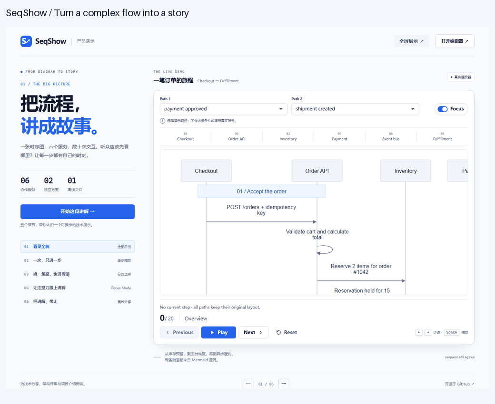
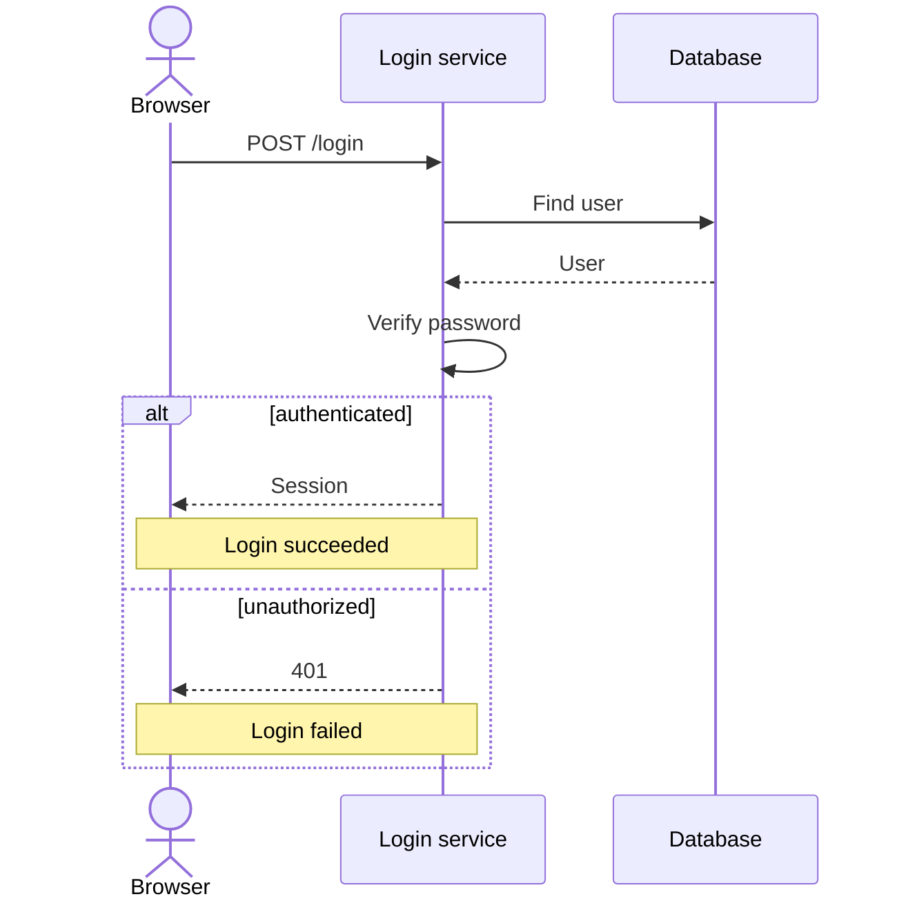

# SeqShow

**Present Mermaid sequence diagrams, step by step.**

Paste a sequence diagram, choose a presentation path, and explain one interaction at a time. Use Focus to guide your audience, then share a single HTML file they can play offline.

No account, backend, or AI API key is required. Your diagram is processed in your browser.

**[Try the live editor](https://kunxianwang.github.io/SeqShow/) · [Take the interactive tour](https://kunxianwang.github.io/SeqShow/showcase.html)**



The showcase uses a real six-service flow with inventory reservation, payment recovery, an outbox, event deduplication, and fulfillment branches. It demonstrates 20 / 24-step paths, Focus, and offline export.

## Start here

- **Just want to see what it does?** Open the [interactive tour](https://kunxianwang.github.io/SeqShow/showcase.html). You can also download the [checkout presentation](demo/checkout.html) or [login presentation](demo/login.html) and open it locally.
- **Want to use your own diagram?** Open the [live editor](https://kunxianwang.github.io/SeqShow/), then follow the [step-by-step guide](#use-your-own-diagram-step-by-step).
- **Want to work locally?** Follow [Run the app locally](#run-the-app-locally) below.
- **Want to contribute?** See [CONTRIBUTING.md](CONTRIBUTING.md).

The hosted editor requires no installation or sign-in. Exported presentations work without the editor or a running server. Diagram source stays in your browser.

> GitHub displays HTML files as source code. Open a demo's file page, choose **Download raw file**, save it with its `.html` extension, and open the downloaded file in your browser. Clicking the GitHub file link alone does not run the player.

## Run the app locally

You need Git, npm, and a supported Node.js version: Node 22.13+ within the 22.x series, Node 24.x, or Node 26+. Development has been verified with Node 22.14.0 and npm 10.9.2.

### Step 1 — Get the project

```sh
git clone https://github.com/KunxianWang/SeqShow.git
cd SeqShow
```

### Step 2 — Install dependencies

```sh
npm ci
```

Use `npm ci` to install the versions recorded in the lockfile.

### Step 3 — Start the editor

```sh
npm run dev
```

Keep the terminal running and open [http://127.0.0.1:5173/](http://127.0.0.1:5173/) in your browser.

The editor automatically loads a login example. Once it is ready, click **Next** or **Play** to try it. You do not need to Render the initial example yourself.

If you prefer a production build:

```sh
npm run build
npm run preview
```

Open [http://127.0.0.1:4173/](http://127.0.0.1:4173/). The production showcase is at [http://127.0.0.1:4173/showcase.html](http://127.0.0.1:4173/showcase.html). Stop the server with Ctrl+C when finished.

Ports are strict: if 5173 or 4173 is already occupied, stop the previous server or pass another port, for example `npm run dev -- --port 5175`, then open that port.

## Use your own diagram: step by step

### Step 1 — Get the Mermaid source

Open the [live editor](https://kunxianwang.github.io/SeqShow/) in your browser. No setup is required. The local editor works the same way if you prefer to run it yourself.

SeqShow accepts **Mermaid sequence diagram text**, beginning with `sequenceDiagram`.

- From a Markdown document, copy the contents inside its Mermaid code block, without the opening/closing triple backticks.
- From a `.mmd` or `.mermaid` file, open it in a text editor and copy the source.
- From another Mermaid editor, copy the source text rather than its rendered image.

SeqShow currently uses **copy and paste**, not file upload. It does not import PNG, SVG, PDF, draw.io files, or Mermaid flowcharts. If you only have an image, recreate it as supported Mermaid sequence source first.

### Step 2 — Paste into Mermaid source

Open the editor and replace the text in **Mermaid source** with your diagram. You can start with this working example:



Use one statement per line. Participant IDs such as `U`, `API`, and `DB` identify endpoints; `as` supplies their visible labels.

Editing marks the existing preview **Source changed** and disables playback/export until you Render again. The old diagram may remain visible as a reference.

### Step 3 — Click Render

Click **Render** and wait for **Ready to present**.

The preview starts at **Overview · 0 / N**, where N is the number of messages and Notes on the selected path. Each message or Note becomes one step. Declarations, comments, and alt/else/end do not count.

The example above has six steps on either path: four shared messages, one selected response, and one selected Note.

If rendering fails:

1. Read the diagnostic and the statement shown below the editor.
2. Click a line/column diagnostic to locate the problem in the source.
3. Correct the input, then click **Render** again.

Unsupported syntax is rejected rather than silently removed. If you already had a valid diagram, a failed Render labels it **Last successful render** and keeps playback/export disabled. Your source remains in the editor.

### Step 4 — Choose the path you want to explain

For diagrams with alt/else, use the **Path** selectors above the diagram.

In the example, select **authenticated** to explain success or **unauthorized** to explain failure. Each top-level alt has its own selector.

- Only the selected case contributes playback steps.
- Changing a path pauses and returns to overview; the step count is recalculated.
- Conditions are labels, **not evaluated expressions**. Selecting authenticated does not perform authentication.
- Unselected cases remain visible as context, with muted styling and hatching, but are skipped during playback.

The first case is selected by default. Diagrams without branches need no path selection.

### Step 5 — Present one interaction at a time

| Control | What it does |
| --- | --- |
| **Next** | Pause and advance one step |
| **Previous** | Pause and go back one step |
| **Play / Pause** | Automatically advance every 1.5 seconds, or pause at the current step |
| **Reset** | Return to overview while retaining your path choices |
| **Focus** | Emphasize the current interaction and related participants |

The narration below the diagram shows the step number, type, endpoints, and full message or Note. Self-calls and Notes are steps too.

Playback stops at the final step. Pressing Play at the end starts again from Step 1. Hiding the browser tab pauses playback.

Focus is on by default. Turning it off restores surrounding context while retaining the current-step marker; it does not change the step or chosen paths. The full diagram keeps the same layout while you present.

Wide diagrams scroll inside the preview. Long narration can also scroll within its own area, without hiding the playback controls.

### Step 6 — Export and share

1. Choose the paths you want the recipient to see initially.
2. Click **Export HTML**.
3. Save the downloaded `seqshow-presentation.html`.
4. Open that file in a browser to check it.
5. Send the **single HTML file** to your audience or colleagues.

The recipient needs no Node.js, installation, account, server, or internet connection. The file contains the rendered diagram and shared player, with no CDN, remote fonts, or Mermaid runtime dependency.

It opens paused at overview with your path choices retained and Focus on. Recipients can still play, pause, go back, reset, toggle Focus, and change paths.

The export contains participant names, message text, and Notes. Original Mermaid source and comments are not included by default. Review diagram content before sharing it.

### Step 7 — Keep the editable source

Copy your Mermaid source to a local file or your existing documentation before closing or refreshing the editor.

**Drafts are not saved across page reloads.** Exported HTML is a presentation, not a Mermaid source backup, and cannot currently be imported back into the editor.

To revise a presentation later, paste your saved source, Render again, and export a new HTML file.

## Explore the examples and showcase

The **Example** menu contains seven examples:

| Example | What to try |
| --- | --- |
| Checkout | Six services, payment success/recovery, fulfillment choices, 20 / 24 steps |
| Login | Success/failure branches |
| API request | A minimal two-message diagram |
| Cache | Branches with different step counts |
| Background job | Two independent path selections |
| Validation | Self-calls, repeated messages, and Notes |
| Chinese order | Unicode labels, aliases, and long text |

If you have edited the source since the last load or successful Render, switching examples asks whether to **Replace current source**. Choose **Cancel** to retain your draft.

For a presentation-style introduction, click **Showcase** in the editor. It opens a new tab and preserves your editor draft.

The showcase has five interactive chapters: **Big picture → One step → Paths → Focus → Share**. Try the chapter's main action or use the real player controls directly. **Fullscreen** enters/exits browser fullscreen; **Open editor** loads the same checkout source in a new tab.

Chapter switches restore the demo's default paths and chapter starting step. The Share action downloads a real offline HTML presentation; chapter headings and the dark showcase frame are not included in the export.

[Overview screenshot](demo/showcase-overview.png) · [Payment recovery screenshot](demo/showcase-recovery.png) · [Offline checkout file](demo/checkout.html)

The showcase itself needs the application's static assets. The downloaded HTML is the self-contained offline presentation.

## Keyboard and accessibility

Tab to the presentation player, then use:

| Key | Action |
| --- | --- |
| ← | Previous |
| → | Next |
| Space | Play / Pause |
| Home | Reset |

The same keys keep their normal behavior in the source editor and form inputs. Native buttons remain operable through Tab, Enter, and Space.

The player provides current-step text outside the SVG, visible focus indicators, and state/count announcements. Reduced-motion preferences disable visual transitions and animated scrolling without disabling playback.

On narrow screens, the editor and preview stack vertically; the diagram scrolls internally.

## Supported Mermaid syntax

SeqShow supports a restricted subset of `sequenceDiagram`, not every Mermaid feature.

| Syntax | Example |
| --- | --- |
| Participant | `participant API` |
| Actor / alias | `actor U as User`, `participant DB as Database` |
| Implicit participants | `A->>B: Request` without prior declarations |
| Solid arrow | `A->>B: Request` |
| Dashed arrow | `B-->>A: Response` |
| Self-call | `A->>A: Validate` |
| Left / right Note | `Note left of A: Text`, `Note right of A: Text` |
| Note over one / two participants | `Note over A: Text`, `Note over A,B: Text` |
| Alternative | `alt success` / `else failure` / `end` |
| Full-line comment | `%% This is a comment` |

Participant IDs begin with an ASCII letter or underscore, followed by letters, digits, underscores, or hyphens. Use aliases for display names with spaces or non-ASCII characters. Chinese labels/messages and long plain-text labels are supported. Notes must reference participants present in the document.

Multiple independent top-level alt blocks are allowed; each has exactly two cases with nonempty labels. Nested alternatives and a third case are unsupported. A case may be empty, but the diagram must have at least one playable message or Note overall.

Repeated messages remain separate steps. Wrapping long labels does not add steps. Solid/dashed arrows preserve their visual meaning; SeqShow does not infer business behavior from them.

**Unsupported:** nested alt, opt / loop / par, activation/deactivation or +/- shorthand, create / destroy, autonumber, rect, other arrows, semicolon-joined statements, HTML / rich text / line-break markup, frontmatter, configuration directives such as `%%{init: ...}%%`, click / links, and other diagram types.

Plain URLs in message text are labels, not automatically fetched resources or executable links.

### Input limits

| Item | Maximum |
| --- | --- |
| Source length | 50,000 UTF-16 code units |
| Participants | 20 |
| Messages + Notes | 200 across all paths combined |
| Top-level alt blocks | 10 |

Over-limit input produces a diagnostic; it is not truncated. Large supported diagrams may take longer to render and require more scrolling.

## Troubleshooting and current limitations

| Problem | What to do |
| --- | --- |
| Preview shows Source changed | Click Render before presenting or exporting |
| Export HTML is disabled | Finish a successful Render of the current source and wait for rendering/export to complete |
| Unsupported-syntax diagnostic | Compare your source against the supported subset; express the intended interactions using supported constructs |
| Old diagram remains after an error | It is a reference, not a successful render of your new input; fix the diagnostic and Render again |
| Downloaded demo opens as text | Download the raw file, keep the .html extension, then open it in a browser |
| Screenshot or draw.io file will not import | Copy/recreate the Mermaid sequence source instead; image/file conversion is not provided |
| Local server will not start | Check Node version and whether its port is already occupied |
| Edits disappear after reload | Draft persistence is not implemented; save source outside the app |

The editor is intended for modern browsers, with Chromium as the primary development target. Browser behavior can vary; Playwright WebKit checks are not certification for real Safari or iOS devices.

Some parser diagnostic messages and the Chinese example's title currently remain in Chinese. The showcase and standard playback controls use English.

The offline guarantee applies to exported HTML. Loading the editor or showcase for the first time requires their static assets. There is no AI generation, business execution, cloud sharing, or GIF/video export feature; the README GIF is a prepared demonstration.

## Contributing

See [CONTRIBUTING.md](CONTRIBUTING.md) for setup, module locations, checks, and issue / pull request guidance.

## License

[MIT](LICENSE) · Copyright 2026 Kunxian Wang.
