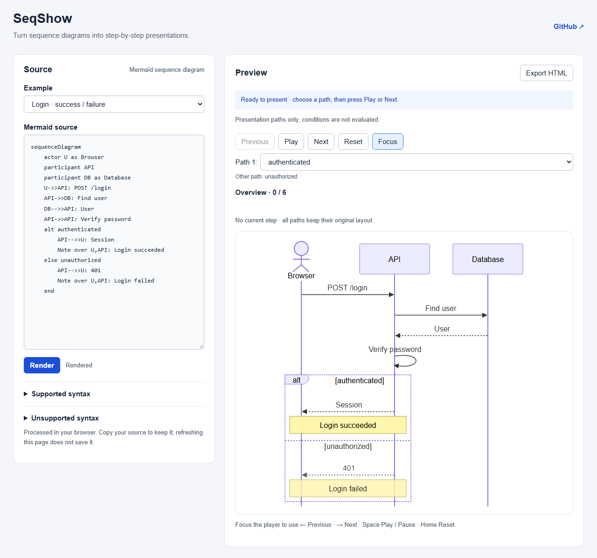

# SeqShow

Present Mermaid sequence diagrams, step by step.

把已有 Mermaid 时序图转换为可以逐步讲解、选择分支、聚焦并离线分享的技术演示。

**当前状态：M0–M3 已完成。** 可以粘贴自己的 Mermaid 时序图，Render 后选择分支、逐步播放或开启 Focus。源码编辑、错误定位与恢复、示例替换保护、键盘和响应式布局已实现；完整离线导出验收与发布准备仍属于 M4/M5。

内置六个原创案例：登录成功/失败、请求响应、缓存命中/未命中、后台任务的两个独立分支、Note/自调用/重复消息、中文订单长文本。修改后旧预览会明确标识并禁用播放和导出；刷新页面不会保存草稿，请先复制源码。



## 开发与生产预览

使用 Node 22（>=22.13）、Node 24 或 Node >=26，以及 npm。实测 Node 22.14.0 / npm 10.9.2；所有依赖固定在 package-lock.json。

```sh
npm ci
npm run dev
```

开发地址：http://127.0.0.1:5173。生产预览：

```sh
npm run build
npm run preview
```

预览地址：http://127.0.0.1:4173。端口采用严格模式，启动前先停止旧预览。开发与 production 均从共享源码生成内联播放器；修改播放器后，页面和导出运行包一起更新。生产构建输出 dist/ 静态文件与独立的 dist/export-player.js。

## 检查

```sh
npx playwright install chromium
npm run typecheck
npm run lint
npm test
npm run test:e2e
```

npm test 为非 watch 的 Vitest 检查。test:e2e 先构建 production，再在隔离的 4174 预览上执行 19 项 Chromium 编辑器及离线回归检查；尚未覆盖完整 E01–E12。Firefox/WebKit 项目仍保留：

```sh
npx playwright install firefox webkit
npm run build
npx playwright test --project=webkit
npx playwright test --project=firefox
```

M3 与 GPT-6 修复联合验证：135 项单元/集成与 19 项 Chromium production 检查通过。Windows WebKit 的登录、键盘、390px 中文与真实下载/离线四项通过，离线文件使用远程请求拦截；未运行 WebKit 全套。Firefox 测试浏览器在本机无法启动，未验证。实际命令、截图与限制见 [联合复核](docs/validation/REVIEW-MERGE-2026-10-07.md)；M3 独立基线见 [M3 验证](docs/validation/M3.md)。

## M0 验证页面

验证器保留 M0 场景并加入 M2 的真实解析场景，使用同一套已安装依赖：

```sh
npm run m0:preview
npm run test:m0
```

M0 页面也使用 4173，不能和生产预览同时启动。可选择 fixture、播放所选路径、切换 Focus 和下载 HTML，暂不接受用户 Mermaid 输入。

当前检查覆盖 18 个 fixture、27 条路径、132 个状态，包含不等长/空分支、特殊参与者 ID、语义绑定、稳定布局、计时器清理，以及在全新 Chromium 上下文中用 file:// 打开真实离线文件。HTML、截图与报告生成在 artifacts/m0/。

可选扩展命令：`node scripts/m0.mjs --browsers=chromium,webkit`（PowerShell 中给参数加引号）。具体浏览器差异见 [M0 记录](docs/validation/M0.md)；它不代表发布兼容性认证。

## 项目文档

| 文档 | 职责 |
| --- | --- |
| [AGENTS.md](AGENTS.md) | 仓库规则、导航与开发流程 |
| [产品定义](docs/PRODUCT.md) | 用户、MVP 范围、语法与完成标准 |
| [技术架构](docs/ARCHITECTURE.md) | Parser、模型、播放、渲染与导出边界 |
| [交互设计](docs/DESIGN.md) | 编辑器、预览、Focus、控件与错误状态 |
| [测试策略](docs/TESTING.md) | 单元、集成、浏览器与离线验收 |
| [MVP 执行计划](docs/exec-plans/active/mvp.md) | 里程碑、决策、进度与验证记录 |
| [M0 验证](docs/validation/M0.md) | 渲染/离线证明、截图与浏览器限制 |
| [M1 验证](docs/validation/M1.md) | 工具链、清洁安装与 production 证据 |
| [M2 验证](docs/validation/M2.md) | 子集解析、纯状态、双浏览器与真实离线文件 |
| [M3 验证](docs/validation/M3.md) | 编辑器、六案例、错误恢复、键盘与响应式证据 |
| [项目调研](docs/research/2026-10-06-github-project-opportunities.md) | 项目方向与竞品快照 |

MVP 目标是浏览器应用、一种默认主题、单层 alt/else、稳定布局、Focus 和独立 HTML 导出。CLI、Agent skill、AI 生成、云分享与视频导出后置。

## 开发流程

用户已批准将 M0–M2 合入 main（a705464）。M3 在 ffang/m3-editor 开发，GPT-6 修复来自 kxw/code-review-parser；本次联合复核通过后，按用户明确授权经 ffang/m3-review-integration 一起合入 main。后续更新继续使用 ffang 开头的分支。每次合并均须仓库所有者对本次合并明确批准，不自动合并。

## 许可证

[MIT](LICENSE)，copyright 2026 Kunxian Wang。
