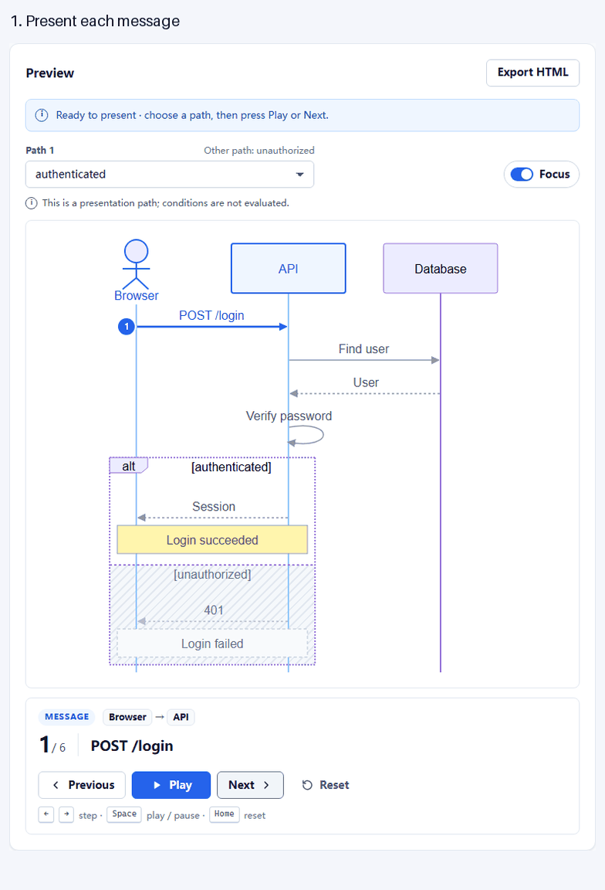
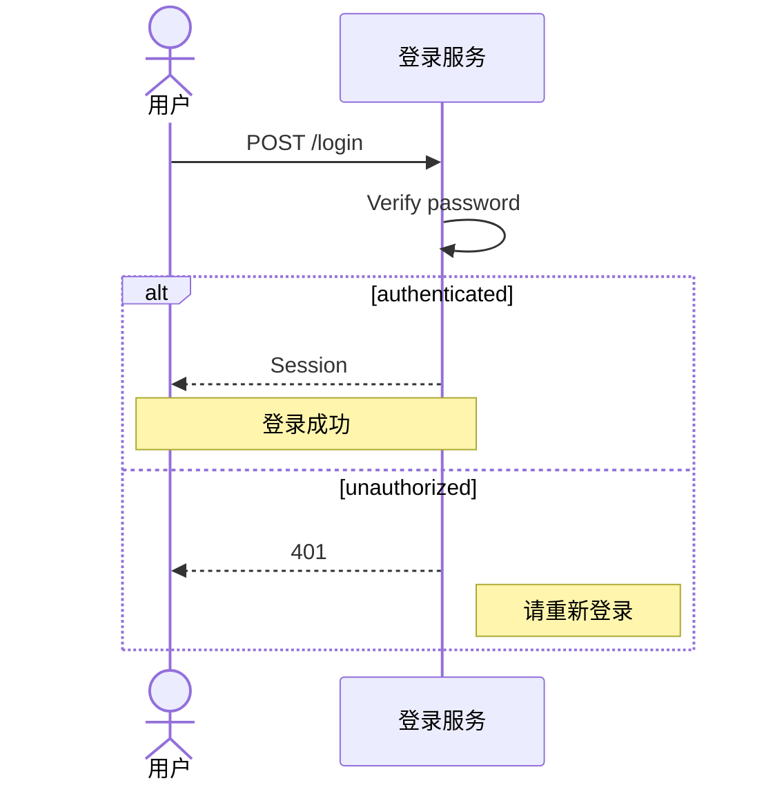

# SeqShow

Present Mermaid sequence diagrams, step by step.

把已有 Mermaid 时序图转换为可以逐步讲解、选择分支、聚焦并离线分享的技术演示。

可以粘贴自己的 Mermaid 时序图，Render 后选择分支、逐步播放或开启 Focus；也可以下载单文件 HTML，发给同事直接离线讲解。无需账号、服务端或 AI API。

**技术 MVP 已完成（M0–M5）并合入 main**，验收记录见 [M5](docs/validation/M5.md)，后续宽图与长消息修复见 [联合复核](docs/validation/REVIEW-M5-MERGE-2026-10-07.md)。尚未公开部署或发布 Release。

内置六个原创案例：登录成功/失败、请求响应、缓存命中/未命中、后台任务的两个独立分支、Note/自调用/重复消息、中文订单长文本。修改后旧预览会明确标识并禁用播放和导出；刷新页面不会保存草稿，请先复制源码。



17 秒真实操作状态演示。也可查看 [静态预览](docs/validation/m5-login-failure-focus.png)或下载下方离线文件。

## 先试一次

运行下方生产预览命令，打开 [本地演示页](http://127.0.0.1:4173/)。选择登录成功/失败路径，点击 Next 或 Play。路径只表示讲解选择，SeqShow 不判断条件是否成立。

也可以下载 [现成的离线登录演示](demo/login.html)，保存为 `.html` 后用浏览器打开；初始为失败路径、总览暂停，可换路径和开启 Focus。GitHub 文件页展示源码，需要下载文件在本地打开。

播放器获得焦点后，使用 ← / → 切步、Space 播放或暂停、Home 重置；编辑器内这些键保留编辑行为。

## 支持的 Mermaid 子集

一行一条语句，以 `sequenceDiagram` 开始。例如粘贴：



支持 participant / actor、as 别名、隐式参与者、`->>` / `-->>`、自调用、重复消息、Note left of / right of / over 一个或两个参与者、中文与纯文本长标签，以及多个独立顶层 alt/else。每条消息或 Note 是一步；未选分支不进入播放步骤。ID 使用 ASCII 字母或下划线开头，后接字母、数字、下划线或连字符；中文名称用 as 标签。

暂不支持嵌套 alt、第三条 case、opt / loop / par、activation、create / destroy、autonumber、rect、其他箭头、分号拼接多语句、HTML / 富文本、frontmatter、配置 directives、click / links 或其他图类型。普通整行 %% 注释可用，%%{…} 指令会被拒绝；详见 [产品语法规范](docs/PRODUCT.md)。

输入上限：50,000 UTF-16 单位、20 个参与者、全图所有路径合计 200 条消息 / Note、10 个 alt。超限给出诊断，不截断。大型图需要更多渲染时间和图内滚动；实测与环境见 [M5 验收](docs/validation/M5.md)。

## 开发与生产预览

使用 Node 22（>=22.13）、Node 24 或 Node >=26，以及 npm。实测 Node 22.14.0 / npm 10.9.2；所有依赖固定在 package-lock.json。

```sh
npm ci
npm run dev
```

开发地址：[127.0.0.1:5173](http://127.0.0.1:5173/)。生产预览：

```sh
npm run build
npm run preview
```

预览地址：[127.0.0.1:4173](http://127.0.0.1:4173/)。端口采用严格模式，启动前先停止旧预览。开发与 production 均从共享源码生成内联播放器；修改播放器后，页面和导出运行包一起更新。生产构建输出 dist/ 静态文件与独立的 dist/export-player.js。尚未提供公开托管演示站点。

## 检查

```sh
npx playwright install chromium
npm run typecheck
npm run lint
npm test
npm run test:e2e
```

npm test 为非 watch 的 Vitest 检查。test:e2e 先构建 production，再在隔离的 4174 预览上执行 33 项 Chromium 编辑器及离线检查，覆盖 E01–E12、同时达到四项输入上限，以及宽图文字尺寸和长消息箭头可见性。Firefox/WebKit 项目保留：

```sh
npx playwright install firefox webkit
npm run build
npx playwright test --project=webkit
npx playwright test --project=firefox
```

M5 的命令、需求覆盖、实际浏览器范围和限制统一见 [验收记录](docs/validation/M5.md)。Chromium 生产检查在 Windows 运行，Firefox 在 WSL Ubuntu 24.04 运行；本机 Windows Firefox 测试二进制有 mozglue 启动错误，不能据此声称 Windows Firefox 已通过。WebKit 是 Playwright 测试引擎，其 file:// 离线检查拦截远程请求；它不等同于真实 Safari 或 iOS 设备验收。Linux 需要浏览器系统依赖与可显示中文的本地字体；可按 [Playwright 官方安装说明](https://playwright.dev/docs/browsers#install-system-dependencies)准备。

导出时选择各条路径，点击 Export HTML 下载 `seqshow-presentation.html`；将这一个文件发给收件人，用浏览器直接打开即可。打开时从总览暂停开始，保留选择并允许改选。文件包含参与者、消息与 Note 标签；原始源码及注释不会默认附带。断网承诺针对导出文件，首次访问编辑器仍需要应用静态资源。

## M0 验证页面

验证器保留 M0 场景并加入 M2 的真实解析场景，使用同一套已安装依赖：

```sh
npm run m0:preview
npm run test:m0
```

M0 页面也使用 4173，不能和生产预览同时启动。可选择 fixture、播放所选路径、切换 Focus 和下载 HTML，暂不接受用户 Mermaid 输入。

当前检查覆盖 18 个 fixture、27 条路径、132 个状态，包含不等长/空分支、特殊参与者 ID、语义绑定、稳定布局、计时器清理，以及在全新 Chromium 上下文中用 file:// 打开真实离线文件。HTML、截图与报告生成在 artifacts/m0/。

可选扩展命令：`node scripts/m0.mjs --browsers=chromium,webkit`（PowerShell 中给参数加引号）。具体浏览器差异见 [M0 记录](docs/validation/M0.md)；它不代表发布兼容性认证。

## 项目文档

| 文档 | 职责 |
| --- | --- |
| [AGENTS.md](AGENTS.md) | 仓库规则、导航与开发流程 |
| [产品定义](docs/PRODUCT.md) | 用户、MVP 范围、语法与完成标准 |
| [技术架构](docs/ARCHITECTURE.md) | Parser、模型、播放、渲染与导出边界 |
| [交互设计](docs/DESIGN.md) | 编辑器、预览、Focus、控件与错误状态 |
| [测试策略](docs/TESTING.md) | 单元、集成、浏览器与离线验收 |
| [MVP 执行计划](docs/exec-plans/completed/mvp.md) | 里程碑、决策、进度与验证记录 |
| [M0 验证](docs/validation/M0.md) | 渲染/离线证明、截图与浏览器限制 |
| [M1 验证](docs/validation/M1.md) | 工具链、清洁安装与 production 证据 |
| [M2 验证](docs/validation/M2.md) | 子集解析、纯状态、双浏览器与真实离线文件 |
| [M3 验证](docs/validation/M3.md) | 编辑器、六案例、错误恢复、键盘与响应式证据 |
| [M4 验证](docs/validation/M4.md) | 独立 HTML、真实下载、播放一致性与导出安全 |
| [M5 验证](docs/validation/M5.md) | 需求与 DoD、生产浏览器、输入上限与发布准备 |
| [M5 后联合复核](docs/validation/REVIEW-M5-MERGE-2026-10-07.md) | 宽图、长消息修复及最终代码的独立复验 |
| [发布准备](docs/release/launch.md) | 演示素材、介绍与 Release 草稿、试用反馈模板 |
| [项目调研](docs/research/2026-10-06-github-project-opportunities.md) | 项目方向与竞品快照 |

MVP 目标是浏览器应用、一种默认主题、单层 alt/else、稳定布局、Focus 和独立 HTML 导出。CLI、Agent skill、AI 生成、云分享与视频导出后置。

## 开发流程

M0–M5、发布前展示材料和 GPT-6 后续修复已按本次用户授权，经 ffang/m5-review-integration 合入 main；范围和复验见联合复核记录。后续更新继续使用 ffang 开头的分支。每次合并均须仓库所有者对本次合并明确批准，不自动合并。技术 MVP 验收与站点发布、真实用户采用及 stars 分开记录。

## 许可证

[MIT](LICENSE)，copyright 2026 Kunxian Wang。
