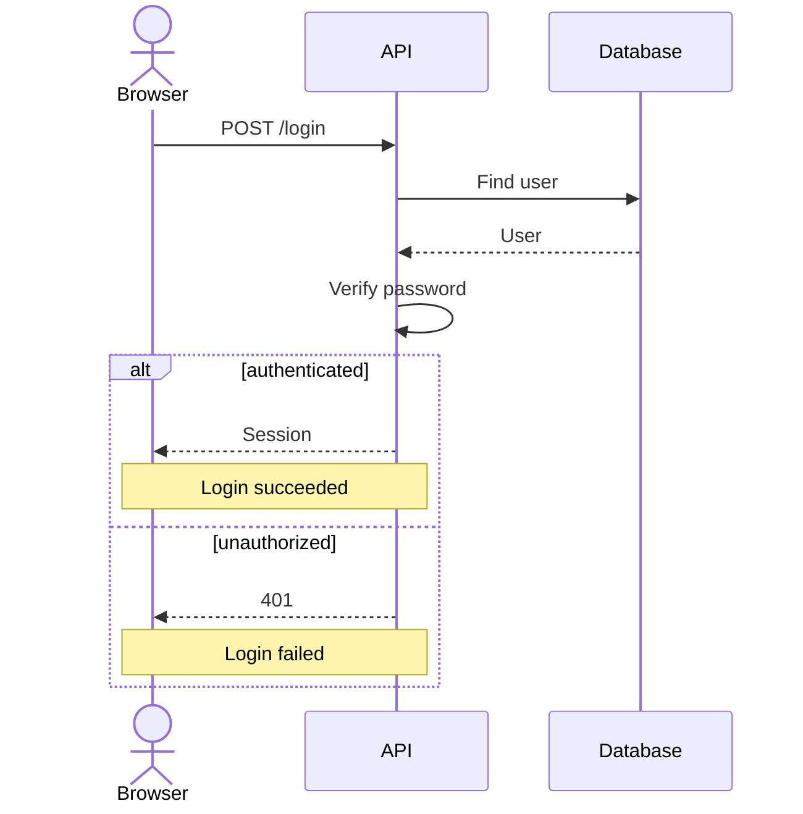

# SeqShow 产品定义

状态：v0.1 产品设计基线；M0–M3 已完成；源码编辑、分支播放与错误恢复通过阶段验收，M4/M5 完整导出与发布验收仍待完成。更新：2026-10-07。

本文件定义产品范围和完成标准。技术实现见 [ARCHITECTURE](ARCHITECTURE.md)，交互见 [DESIGN](DESIGN.md)，验证见 [TESTING](TESTING.md)，执行见 [mvp.md](exec-plans/active/mvp.md)。

## 1. 产品承诺

**把已有 Mermaid 时序图转换成可以逐步讲解、播放和离线分享的技术演示。**

英文定位：Turn Mermaid sequence diagrams into step-by-step technical presentations.

用户粘贴自己的图，选择一条分支路径，逐步突出消息和参与者，导出一个断网也能播放的 HTML 文件。产品不生成系统事实，也不判断业务条件是否真的成立。

## 2. 用户、问题与目标

| 用户 | 已有工作 | 希望完成的任务 |
| --- | --- | --- |
| 技术写作者、开源维护者 | 文档中的时序图 | 将流程用于文章、项目介绍或演示 |
| 后端、前端开发者 | 登录、API、异步任务的交互图 | 向同事逐步解释一次请求与失败分支 |
| 技术分享者 | 讲解素材 | 暂停、回退和聚焦当前消息，避免整张图同时抢占注意力 |

首要痛点：静态图信息同时出现，讲解者需要手动指出当前步骤；分支容易混淆；分享交互成果需要额外制作工具或在线服务。

项目目标：单人可启动，开发者可直接试玩，核心流程可验证，争取首批 100 GitHub stars。100 stars 是传播目标，不是必然结果，也不作为应用验收的门槛。

核心价值假设：目标开发者愿意拿自己的时序图来使用，并将结果用于真实讲解或技术内容。需要后续试用验证；目前尚未进行用户访谈。

## 3. 核心工作流

1. 打开页面，看到一个可直接播放的登录示例。
2. 粘贴自己的 Mermaid 源码，点击 Render。
3. 查看输入诊断；成功后选择各 alt 的演示分支。
4. Previous / Next 或 Play / Pause；Focus Mode 突出当前步骤。
5. 导出当前图与分支设置为一个独立 HTML 文件。
6. 收件人直接打开文件，断网状态下仍能切换分支、播放和回退。

Web 页不要求登录、API key 或后台服务。首次在线访问需要下载应用静态资源；离线承诺针对导出 HTML，不承诺 Web 页本身具有 PWA 缓存。

## 4. MVP 范围与需求编号

| 编号 | 必须实现的行为 | 验收重点 |
| --- | --- | --- |
| P01 | 浏览器编辑器、Render、现成登录示例 | 自己的输入能生成演示，无登录和 AI API |
| P02 | 下述 Mermaid 语法子集 | 隐式参与者、别名、自调用、中文、重复消息和长文本正确 |
| P03 | 一层 alt/else 的路径选择 | 分支互斥，选择不会执行条件或播放另一分支 |
| P04 | Previous / Next / Play / Pause / Reset | index 为 0..N，末尾停播，回退一致，无重复计时器 |
| P05 | Focus Mode 和稳定布局 | 高亮当前消息或 Note 及相关参与者，切步不重排图 |
| P06 | 定位清楚的错误与恢复 | 非支持语法不丢失，编辑后能再次成功 Render |
| P07 | 真正独立的 HTML 导出 | 无 CDN、网络字体、fetch 和 Mermaid 运行依赖；断网与 file:// 可操作 |
| P08 | 桌面及窄屏布局、键盘和减少动画 | 控件可操作，图可滚动，无全页意外横向溢出 |
| P09 | 用户内容作为纯文本数据处理 | 不执行输入中的标签、脚本、指令或链接 |
| P10 | 六个可重现的内置案例与使用说明 | 包含成功/失败、自调用、Note、中文长文本和重复消息 |

P02 与 P03 是受限 Mermaid 兼容，不宣称完整支持。P10 的部分案例可以组合多个覆盖点，不要求六套不同业务系统。

## 5. 支持的语法与输入约束

### 5.1 语法清单

一行一条语句，首个有效语句为 sequenceDiagram。空行及以 %% 开头的普通整行注释可忽略；%%{...} 配置指令不属于普通注释，必须拒绝。

| 语法 | MVP 行为 |
| --- | --- |
| participant A / participant A as API | 声明矩形参与者及纯文本标签 |
| actor U / actor U as User | 声明 actor；映射与参与者高亮一致 |
| A->>B: message | 实线有箭头消息 |
| A-->>B: message | 虚线有箭头消息，不推断它必然是 return |
| 消息中未声明的 A / B | 按首次出现注册隐式参与者 |
| A->>A: message | 自调用，占一个消息步骤 |
| Note left of A: text / Note right of A: text | 对已存在的参与者添加 Note，Note 占一个步骤 |
| Note over A: text / Note over A,B: text | 覆盖一个或两个已存在的参与者 |
| alt label / else label / end | 一个 block 有两个带非空标签的 case，case 内只含 Message / Note；多个顶层 block 可串联 |

参与者 ID 首版为 ASCII 字母或下划线开头，后接字母、数字、下划线或连字符；中文名称通过 as 标签展示，消息与 Note 支持中文。显式声明顺序优先，隐式参与者在需要时追加。Note 的“已存在”指能在整份文档的参与者表中解析，不要求声明必须出现在 Note 前一行。重复声明与未知 Note 参与者给出错误；不通过文本内容合并重复消息。

文本标签按纯文本显示。消息/Note 的语法冒号可跟一个格式空格；消费该分隔空格后，剩余内容完整保留，包括额外前后空格、URL、冒号和普通标点。HTML 标签、富文本或换行标记不在兼容承诺内：检测到标记输入时报告当前不支持，不能执行或静默转换。长文本允许视觉折行，不能因此增加步骤。

不支持：嵌套 alt、第三条 case、opt、loop、par、activation/deactivation、+/- 激活简写、create/destroy、autonumber、rect、其他箭头、分号拼接多语句、frontmatter、配置 directives、click/links 与 Mermaid 其他图类型。诊断区分 Mermaid 本身的语法错误和 SeqShow 暂不支持的合法 Mermaid 语法。

### 5.2 输入限额

首版上限：源码 50,000 个 UTF-16 code units；参与者 20 个；全图 Message + Note 合计 200 个；顶层 alt block 10 个。超限给出明确错误，不截断。限额是保护浏览器交互的产品边界，尚非性能实测结果；调整时同步测试与说明。

### 5.3 分支与步骤语义

- 每个 alt 都有独立选择器，显示源码中的 case 标签。初始选第一条，并标注“演示路径，条件未求值”。
- 当前播放路径由共同步骤和每个 alt 的所选 case 构成；其他 case 不进入步骤列表。
- Step 0 / N 为总览，没有当前步骤高亮；Step k / N（k ≥ 1）聚焦第 k 个 Message 或 Note。
- alt / else / end、参与者声明和普通注释不占步骤。仅有参与者、没有可播放 Message / Note 的图给出“没有可播放步骤”。
- 改变任一分支时暂停，回到 Step 0，重算 N；不从旧 index 猜测恢复位置。允许单条 case 无步骤；整图仍必须有至少一个步骤，选中空路径时停在 0/0，Play/Next/Previous 禁用。
- 从 Step 0 按 Next 到 1；从 Step N 按 Previous 到 N-1。播放到 N 时停在 N，保留最后一步高亮；再次 Play 从 Step 1 开始。
- 1500 ms 自动推进一次，不要求用户等待视觉动画完成；隐藏页面时暂停。Focus 开关不修改 index 或分支。

## 6. 首要验收示例

任一所选路径共 6 步：四个共同消息、一个所选响应、一个所选 Note。成功路径不播放 401；失败路径不播放 Session。完整图的位置在两条路径和每次切步时保持一致。

导出后，在 file:// 与断网环境打开，仍可切换这两个路径；默认恢复导出时的路径选择，从 Step 0 暂停开始。

## 7. 用户故事

| 编号 | 故事 | 关联需求 |
| --- | --- | --- |
| US01 | 我粘贴自己的图，可以看到明确的支持情况并开始讲解 | P01、P02、P06 |
| US02 | 我讲成功或失败流程时，只播放选择的路径 | P03、P04 |
| US03 | 我暂停、回退时，听众仍知道当前消息和上下文在哪里 | P04、P05 |
| US04 | 我把文件发给同事，对方不安装应用也能离线操作 | P07、P09 |
| US05 | 我在窄屏或仅使用键盘时，也能编辑并控制演示 | P08 |
| US06 | 我先试玩案例，再换成自己的流程，不会意外丢掉正在编辑的内容 | P01、P06、P10 |

## 8. Non-goals

首版不做 CLI、npm 公共包、Agent skill、GitHub Action、AI 解释或生成、录音、GIF/视频导出、多人协作、账号、后端、数据库、云分享链接、嵌入 SDK、文档平台插件、多主题和其他图类型。

不模拟业务执行，不根据图中的自然语言计算认证或条件结果，不把输出当成代码行为证据。不承诺整个 Web 编辑器断网可用，也不承诺 README 内可直接运行交互 HTML。

首版的分享方式是下载并发送 HTML；README 展示静态预览和演示页链接。静态 SVG 导出等其他输出延后，不增加第二套导出管线。

## 9. Definition of Done

- [ ] P01–P10 全部具有 TESTING 定义的验收证据。
- [ ] 上述登录分支案例、重复消息、自调用、Note、中文长文本都可正确映射并播放。
- [ ] Focus Mode 的步骤、计数、上下文和分支一致，切步无重新布局。
- [ ] 错误输入不丢失源码，不显示旧图为新图的成功结果，修正后可恢复。
- [ ] 导出产物断网运行且不加载网络资源，功能与 Web 的播放语义一致。
- [ ] typecheck、lint、unit/integration、Playwright E2E、production build 按 TESTING 通过；浏览器范围和任何已知限制如实记录。
- [ ] README 包含真实安装/运行步骤、语法范围、示例、限制、许可证说明和演示方式。
- [ ] mvp.md 各实现里程碑记录完成证据与剩余问题；未实施用户测试和未获得 stars 不伪装为完成。

## 10. 发布后的产品验证

找约 10 位技术写作者或开源维护者，以他们自己的图试用。建议继续信号：至少 3 位把产物用于真实内容、至少 2 位再次使用。这个门槛是试验约定，不是统计结论。

分开记录试玩、自带输入、成功生成、实际导出、成果采用、重复使用、仓库访问和 stars。首版不植入追踪源码或用户身份的分析 SDK；先通过自愿反馈和发布渠道记录验证。后续公开发布或联系他人按用户授权进行，不由本规格自动触发。
